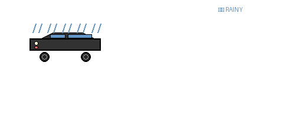

# 👋 `Hello World` from Disguised Coffee

### Embedded Systems Developer | Open Source Enthusiast | Tech Explorer

---

## 📝 About Me

I am an Embedded Systems Developer dedicated to building efficient systems for resource-constrained environments. Currently, I'm deep-diving into Real-Time operating systems and FPGA devices to look into high-speed, critical systems. I’m a firm believer in the power of hardware-software co-design to bridge the gap between silicon and code.

---

## 🛠️ Technical Toolbox

### 🔤 Language Badges

&nbsp;&nbsp;&nbsp;
&nbsp;&nbsp;&nbsp;
&nbsp;&nbsp;&nbsp;
&nbsp;&nbsp;&nbsp;

### 🦾 Embedded Stack:

&nbsp;&nbsp;&nbsp;
&nbsp;&nbsp;&nbsp;
&nbsp;&nbsp;&nbsp;

### 🎨 DevOps/Tools:

&nbsp;&nbsp;&nbsp;
&nbsp;&nbsp;&nbsp;
 &nbsp;&nbsp;&nbsp;
  &nbsp;&nbsp;&nbsp;
  &nbsp;&nbsp;&nbsp;
  

---
<!-- 
## 🚗 Daily Animated Car

  

  <em>This animated car updates daily! It changes between normal ☀️ and rainy 🌧️ conditions.</em>

--- -->

***Made with ❤️, Powered by ☕***

